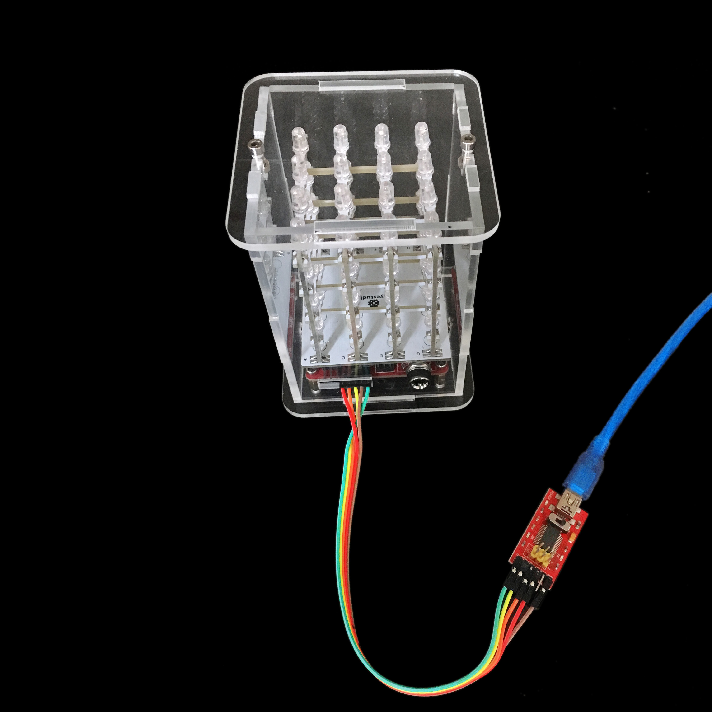

# **keyestudio 4X4X4 RGB LED CUBE KIT**

## 1.Introduction

keyestudio 4*4*4 RGB LED CUBE KIT consist of 64 RGB LEDs soldered in the
combination of 4*4*4. It's then driven by ARDUINO. RGB LED CUBE emits a warm
light, which is enjoyable for people of any age. You can also use it as a mood
light, or create your own "ambient device" that gently notifies you of new
emails or instant messages!

The RGB LED CUBE KIT is supplied as a partly-assembled kit:

The controller board is based on an Arduino-compatible 8*8 LED RGB Matrix
driver board. All RGB LEDs are soldered to the plane PCB, and tested okay. You
just need to solder and assemble the 3D matrix.

The RGB LED CUBE KIT comes with a sketch pre-installed that runs through a test
pattern.

## 2.Features

• 64 RGB LEDs

• Simple assembly using a PCB frame

• 8*8 LED RGB Matrix driver board (Arduino compatible)

• 7-12V independent power supply

• Arduino driver library with example programs

## 3.Part List

1: controller 8*8 LED RGB Matrix driver board (1 PCS)

2: soldering fixture (1 PCS)

3: top acrylic board (1 PCS)

4: bottom acrylic board (1 PCS)

5, 6, 7, 8: acrylic side boards,
in which 5 and 7 is identical ( 4 in total)

1: plane PCB strips with LEDs (16 PCS)

2: holder bottom board(1 PCS)

3: fixing strips for the PCB strips (8 PCS)

4: copper bush (4 PCS)

5: 16P header strips（2 PCS）

6: 3*10 inner hexagon screw（4 PCS）

7: 3M nut（4 PCS）

8: holder stick (8 PCS)

9: DC socket (1 PCS)

10: 3*6 inner hexagon screw（8 PCS）

\*\*\*\*\*\*\*\*\*\*\*\*\*\*\*\*\*\*\*\*\*\*\*\*\*\*\*\*\*\*\*\*\*\*\*\*\*\*\*\*\*\*\*\*\*\*\*\*\*\*\*\*\*\*\*\*\*\*\*\*\*\*\*\*\*\*\*\*\*\*\*\*\*

self-prepared tools: Soldering iron & solder

## 4.Soldering instructions:

1). Bottom board soldering

Plug the two 16P header strips vertically onto the holes of the bottom board
(the side with no keyestudio logo facing up as above pic. shown ) , then solder
the pins.

Adjust the header strip for it to be vertical to the board, then solder it.

2). Soldering of plane PCB strips with LEDs

Disassemble the plane PCBs as above pic. shows.

Next, disassemble the fixing strips for the PCB strips.

Set the 4 copper bushes in standing position, place 4 plane PCB strips to the
soldering fixture. The black lines on the plane PCBs are position indicators for
latter soldering of fixing strips.

Place the soldering fixture on top of the 4 copper bushes, then place two fixing
strips between the black indicator lines, then add solder to the 8 solder points
for fixing. （Notice: the solder point of fixing strip should be close to solder
point of 4 plane PCB strips )

Above is a pic. when you finish soldering of the 8 soldering points.

Repeat the above steps to finish the other three.

3). Install the holder sticks

Every holder stick has a dedicated position, so before installation, pls read
this instruction for the positioning of each stick. As above pic. shows, stick A
belongs to hole A of the bottom board, stick B belongs to hole B and etc. 8
sticks for 8 holes correspondingly.

As above picture, position the 4 soldered plane PCBs in a uniform direction.
Install stick A on the recess area. And don’t solder just yet!

Repeat above step and install stick C, E and G.

Install stick B on the recess area. And don’t solder just yet!

Repeat the above step and install stick D, F, and H.

Plug the above assembled part into the bottom board.

After plugging in, adjust the assembled part and the bottom board for them to be
in vertical position.

Next, add solder to the solder pad areas. For places where solder pads are only
on the plane PCBs but not the sticks, they don’t need to be soldered.

Then add solder to the solder pads between the bottom board and the sticks.
After all solder pads are soldered, check to see if there are areas left. Above
is a pic. with soldering finished.

4). Install the assembled parts

Use 4 3\*6 screws to fix the 4 copper bushes onto the acrylic bottom boards.

Next, fix the driver board onto the copper bushes using 3\*6 screws in a
direction as above pic.

Note: the control board has a toggle switch, if connecting external DC 7-12V
power, toggle switch must be set to Header terminal, or else it will burn out
the control board; if set to Terminal terminal, external power only can accept
5V.

Strip a Dupont wire, solder the copper wire to the driver board as above pic.

Install the DC socket to the acrylic side board 5, the direction as above
picture.

Install the acrylic side board 5 to the bottom board. Then solder the copper
wire, the one close to the screw to the shorter lead of the DC socket (positive
end), the other copper wire solder to the longer lead (negative end).

Plug the header pins of the bottom board(direction as above pic.) to the female
headers of VCC, GREEN, VCC of the driver board, pay attention not to reverse.

Place the other 3 side boards according to the shape of groove of the acrylic
bottom board.

Note: The holes of acrylic side boards are aligned with the corresponding
positions of control board.

Place the top acrylic board according to the groove shape.

After installation of the top acrylic board, turn the part upside down, use two
3\*10 screws and two 3M nuts to fix the side board.

A pic. after screws fixed.

Then, install the screws on the top acrylic board.

All installation finished!

## 5.Projects

### **Wiringwiring table:**

| RGB Matrix driver board | Arduino FTDI basic program downloader |
|-------------------------|---------------------------------------|
| VDD                     | 5V                                    |
| GND                     | GND                                   |
| DTR                     | RST                                   |
| TXD                     | RXD                                   |
| RXD                     | TXD                                   |

### **Connection Diagram:**

Import library files and select the corresponding control board type and port

After wiring successfully, connect the FT232 module to the computer with the
mini USB cable.  
Open the product introduction PDF file, observe the code, and find Colorduino.h
library file.

Then we put “Colorduino” into the libraries folder of the IDE's installation
address.

After setting well, open the 1.8.10 version of the IDE, copy the PDF program to
the Arduino IDE, set the board and the COM port (after installing the FT232
module driver, there is a corresponding COM displayed).

Click and upload program，Upload
successfully.

### **Sample Code:**

    \##include \<Colorduino.h\>

    typedef struct

    {

    unsigned char r;

    unsigned char g;

    unsigned char b;

    } ColorRGB;

    //a color with 3 components: h, s and v

    typedef struct

    {

    unsigned char h;

    unsigned char s;

    unsigned char v;

    } ColorHSV;

    unsigned char plasma[ColorduinoScreenWidth][ColorduinoScreenHeight];

    long paletteShift;

    //Converts an HSV color to RGB color

    /\*void HSVtoRGB(void \*vRGB, void \*vHSV) /////////////////////////////////////

    {float r, g, b, h, s, v; //this function works with floats between 0 and 1

    float f, p, q, t;

    int i;

    ColorRGB \*colorRGB=(ColorRGB \*)vRGB;

    ColorHSV \*colorHSV=(ColorHSV \*)vHSV;

    h = (float)(colorHSV-\>h / 256.0);

    s = (float)(colorHSV-\>s / 256.0);

    v = (float)(colorHSV-\>v / 256.0);

    //if saturation is 0, the color is a shade of grey

    if(s == 0.0) {

    b = v;

    g = b;

    r = g;

    }

    //if saturation \> 0, more complex calculations are needed

    else

    {

    h \*= 6.0; //to bring hue to a number between 0 and 6, better for the
    calculations

    i = (int)(floor(h)); //e.g. 2.7 becomes 2 and 3.01 becomes 3 or 4.9999 becomes 4

    f = h - i;//the fractional part of h

    p = (float)(v \* (1.0 - s));

    q = (float)(v \* (1.0 - (s \* f)));

    t = (float)(v \* (1.0 - (s \* (1.0 - f))));

    switch(i)

    {

    case 0: r=v; g=t; b=p; break;

    case 1: r=q; g=v; b=p; break;

    case 2: r=p; g=v; b=t; break;

    case 3: r=p; g=q; b=v; break;

    case 4: r=t; g=p; b=v; break;

    case 5: r=v; g=p; b=q; break;

    default: r = g = b = 0; break;

    }

    }

    colorRGB-\>r = (int)(r \* 255.0);

    colorRGB-\>g = (int)(g \* 255.0);

    colorRGB-\>b = (int)(b \* 255.0);

    }

    float dist(float a, float b, float c, float
    d)///////////////////////////////////////////////////////

    {

    return sqrt((c-a)\*(c-a)+(d-b)\*(d-b));

    }

    void plasma_morph() //////////////////////////////////////////////

    {

    unsigned char x,y;

    float value;

    ColorRGB colorRGB;

    ColorHSV colorHSV;

    for(y = 0; y \< ColorduinoScreenHeight; y++)

    for(x = 0; x \< ColorduinoScreenWidth; x++) {

    {

    value = sin(dist(x + paletteShift, y, 128.0, 128.0) / 8.0)

    \+ sin(dist(x, y, 64.0, 64.0) / 8.0)

    \+ sin(dist(x, y + paletteShift / 7, 192.0, 64) / 7.0)

    \+ sin(dist(x, y, 192.0, 100.0) / 8.0);

    colorHSV.h=(unsigned char)((value) \* 128)&0xff;

    colorHSV.s=255;

    colorHSV.v=255;

    HSVtoRGB(&colorRGB, \&colorHSV);

    Colorduino.SetPixel(x, y, colorRGB.r, colorRGB.g, colorRGB.b);

    }

    }

    paletteShift++;

    Colorduino.FlipPage(); // swap screen buffers to show it

    }\*/

    /\*\*\*\*\*\*\*\*\*\*\*\*\*\*\*\*\*\*\*\*\*\*\*\*

    Name: ColorFill

    Function: Fill the frame with a color

    Parameter:R: the value of RED. Range:RED 0\~255

    G: the value of GREEN. Range:RED 0\~255

    B: the value of BLUE. Range:RED 0\~255

    \*\*\*\*\*\*\*\*\*\*\*\*\*\*\*\*\*\*\*\*\*\*\*\*

    void ColorFill(unsigned char R,unsigned char G,unsigned char B)

    {

    PixelRGB \*p = Colorduino.GetPixel(0,0);

    for (unsigned char y=0;y\<ColorduinoScreenWidth;y++) {

    for(unsigned char x=0;x\<ColorduinoScreenHeight;x++) {

    p-\>r = R;

    p-\>g = G;

    p-\>b = B;

    p++;

    }

    }

    Colorduino.FlipPage();

    }

    void setup()

    {

    Colorduino.Init(); // initialize the board

    // compensate for relative intensity differences in R/G/B brightness

    // array of 6-bit base values for RGB (0\~63)

    // whiteBalVal[0]=red

    // whiteBalVal[1]=green

    // whiteBalVal[2]=blue

    //http://keyes-arduino.taobao.com

    unsigned char whiteBalVal[3] = {36,63,63}; // for LEDSEE 6x6cm round matrix

    Colorduino.SetWhiteBal(whiteBalVal);

    // start with morphing plasma, but allow going to color cycling if desired.

    paletteShift=128000;

    unsigned char bcolor;

    //generate the plasma once

    /\*for(unsigned char y = 0; y \< ColorduinoScreenHeight; y++)

    for(unsigned char x = 0; x \< ColorduinoScreenWidth; x++)

    {

    //the plasma buffer is a sum of sines

    bcolor = (unsigned char)

    (

    128.0 + (128.0 \* sin(x\*8.0 / 16.0))

    \+ 128.0 + (128.0 \* sin(y\*8.0 / 16.0))

    ) / 2;

    plasma[x][y] = bcolor;

    }\*/

    // to adjust white balance you can uncomment this line

    // and comment out the plasma_morph() in loop()

    // and then experiment with whiteBalVal above

    ColorFill(0,0,0);

    }

    void loop()

    {

    //plasma_morph();

    ColorFill(255,0,0);

    delay(2000);

    ColorFill(0,255,0);

    delay(2000);

    ColorFill(0,0,255);

    delay(2000);

    // ColorFill(255,255,255);

    // delay(1000);

    }

After program is uploaded, with power on , you can see the beautiful light
effect.

## 6.Resources link needed for the project

ARTDUINO software download address: <https://www.arduino.cc/en/Main/Software>

Arduino official address: <https://www.arduino.cc/>

Keyestudio official address: <https://www.keyestudio.com>

Project library: https://fs.keyestudio.com/KS0177

For reference: <http://www.hownottoengineer.com/projects/rgb-led-cube.html>

<http://www.instructables.com/id/4x4x4-RGB-LED-Cube/>
